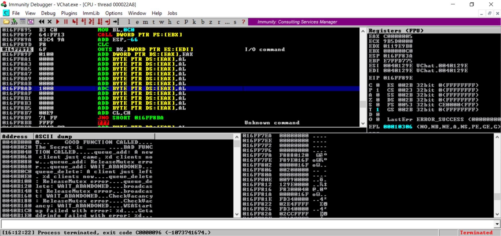

> [!IMPORTANT]
> The Metasploit Module is a Work In Progress. Currently the string being sent gets mangled leading to a crashed process state due to unhandled exceptions.
>
> 
>
> Once rectified we will need to modify it so 2 messages can be sent (Manual socket usage or preform multiple connections).

# Assorted Links
https://www.offsec.com/metasploit-unleashed/egghunter-mixin/

https://github.com/rapid7/metasploit-framework/blob/master/tools/exploit/egghunter.rb

https://www.offsec.com/metasploit-unleashed/writing-an-exploit/

