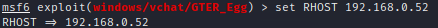
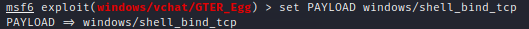

# GTER Metasploit Module
The creation of the Metasploit module follows some of the patterns and ideas discussed in the [Making-Dos-DDoS-Metasploit-Module-Vulnserver](https://github.com/DaintyJet/Making-Dos-DDoS-Metasploit-Module-Vulnserver/tree/main/MetasploitModules) document. We will not be discussing how the Metasploit module is made here, and will only cover how to install it on a Kali Linux system and how to use the Metasploit module.

> [!IMPORTANT]
> Offsets may vary. Additionally if you recompile the executables or have ASLR enabled the address of the `jmpesp` target may vary.

## Installing a Module

The **first** thing that you need to do is have the [Metasploit Framework](https://github.com/rapid7/metasploit-framework) installed on your system (Generally a Kali VM). You can verify this with the following command:

```sh
$ msfconsole -v
```

> [!NOTE]
> The Metasploit Framework in most cases will be installed by default on a Kali Linux or any other penetration testing platform you have chosen.


Once you have the *Metasploit Framework* you can now **download or write** the Metasploit module. This is going to be an [Exploit Module](https://docs.metasploit.com/docs/modules.html#exploit-modules-2437) since it includes a *payload* and preform the exploitation of a target system/process. This means we need to place the Ruby program into the `/usr/share/metasploit-framework/modules/exploit/`. Further since this is a Windows exploit we can place it in the `/usr/share/metasploit-framework/modules/exploit/windows` directory, within that I made a `vchat` directory to further organize the exploits.

```sh
$ sudo mousepad /usr/share/metasploit-framework/modules/exploit/windows/vchat/GTER_Egg.rb
```

> [!NOTE]
> You can use a text editor like `mousepad`, `vim`, `emacs`, etc. To make the new file, you can also use `cp` or `mv` to place the file into the correct directory if you have made it elsewhere.


When we start the Metasploit console with the `msfconsole` command it should load the modules in the `/usr/share/metasploit-framework/modules` directory and subdirectories. However to be safe, as the server could have already been started we can use the `reload_all` command to reload all modules.

1. Starting `msfconsole` 

    

2. Use the `reload_all` command to reload the modules.

    

Once the modules are loaded we can then use the [`search`](https://www.offsec.com/metasploit-unleashed/msfconsole-commands/#search) command to find the modules of interest. This looks for patterns in the path to the module, the description and other attributes. You can look at the other options with the `-h` flag. 


Then we can select the `GTER_Egg` module with the [`use`](https://www.offsec.com/metasploit-unleashed/msfconsole-commands/#use) command followed by the index of the module we want to use. In my case this was `0`.


> [!NOTE]
> We can see the prompt has changed to show us using the module, with the name/path in red.

Once we have selected a module there are a [number of commands](https://www.offsec.com/metasploit-unleashed/using-exploits/) we can use, we will only be using a small subset of them. Namely we will be using `show` to show what we can configure, with `set` we will configure options used to control the exploit, and finally we will use `exploit` to launch the exploit.

1. Show options

    

   * The *Module Options* are those specific to our module. The `RETOFFSET_TRUN` is a custom option for telling the exploit the offset to the *return* value on the stack for the TRUN command. The option `RETOFFSET_GTER` is used to set the offset of the *GTER* command. The other options, `RHOSTS` and `RPORT` are use to control the remote connections our exploit will make and are from the ` Msf::Exploit::Remote` class we inherit. Finally the `EGG_TAG` is used to control the *Tag* inserted at the front of the shellcode
   * The `Payload` options are used to control the behavior of the payload. With `EXITFUNC` telling the payload generator how the exploit will be ran (Thread vs Process), then `LHOST` and `LPORT` tell the payload how to connect back to up. The `LHOST` and `LPORT` are set automatically by Metasploit in most cases, if you have multiple interfaces it may not set the right one.

2. Set Options, you use the keyword `set` followed by the option name and the value you want to configure it to be:

    

3. Configure Payload, this also use the keyword `set` followed by the word `payload` and the one we would like to use in the exploit.
 
    

   * You will need to change the payload to be a variant of the bind-shell for this to work as we do not account for the time it takes the egghunter to find the payload. If you use a reverse shell you should configure a netcat listener separately.

> [!NOTE]
> We can use the command `show payloads` to list all possible payloads that can be used with the exploit.
>
> 
>
> Then we can use the numeric value next to the payload name and description to set the payload that will be used.
>
> 


Once configured we can use the keyword `exploit` to launch the attack.


> [!IMPORTANT]
> You will need to setup a netcat session with the target machine. Even though Metasploit tells you the exploit failed, you will just have to wait some time for the egg hunter to find the shellcode for the bind shell.

## Additional References
[[1] Egghunter Mixin](https://www.offsec.com/metasploit-unleashed/egghunter-mixin/)

[[2] Egghunter.rb File](https://github.com/rapid7/metasploit-framework/blob/master/tools/exploit/egghunter.rb)

[[3] Writing and Exploit](https://www.offsec.com/metasploit-unleashed/writing-an-exploit/)

